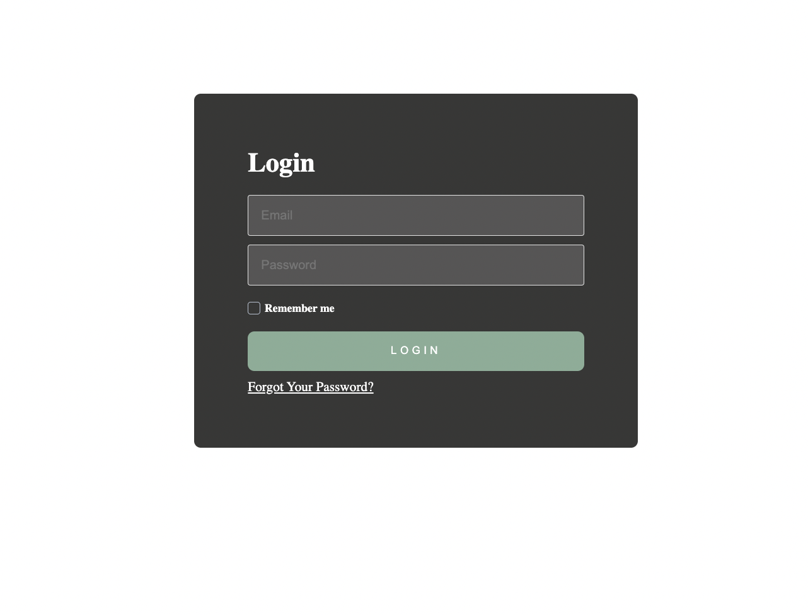
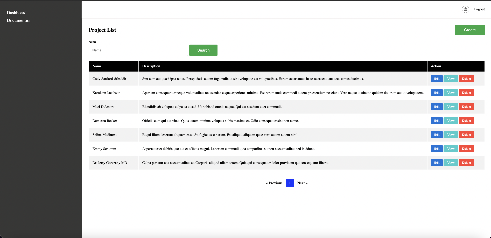
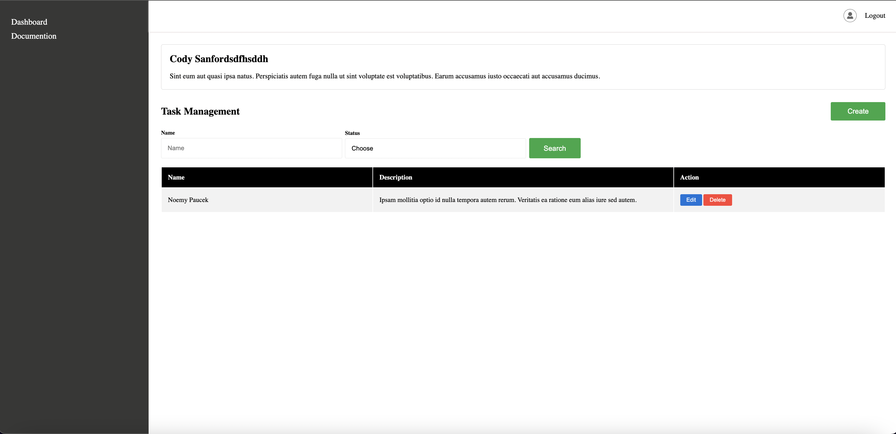

## Project Management Tool Development

This project is a project management tool developed using Laravel. It helps you manage your projects and tasks effectively.

### Project Description

This project is a tool for managing your projects and tasks, developed with the Laravel framework. It uses the Repository Pattern for organization. Users can register, log in, and manage their projects and tasks.

### Technologies and Packages Used
- **Laravel 11:** A PHP-based web development framework.
- **Repository Design Pattern:** The project uses a structure consisting of Interface, Service, and Repository files.

### Features

- User Registration and Login: Users can register and log in.
- Project Management: Create, edit, and delete projects.
- Task Management: Assign tasks to projects and track their status.

## Installation

To set up the project, follow these steps:

1.Clone the Repository

To set up the project, follow these steps:

```bash
   git clone https://github.com/aghamurtuzov/Project-Management.git
   ```

2.Install Dependencies

Navigate to the project directory and install the required packages:

```bash
   composer install
   ```

3.Copy the Environment File

Copy the .env.example file to .env and configure the necessary settings:

```bash
   cp .env.example .env
   ```

4.Generate Application Key

Generate an application key for the Laravel application:

```bash
   php artisan key:generate
   ```

5.Run Database Migrations

Create the database schema by running:

```bash
   php artisan migrate
   ```

6.Start the Server

Start the development server:

```bash
   php artisan serve
   ```

Your project will be available at: http://localhost:8000

## Project Structure

The project is designed using the Repository Pattern and is organized as follows:

- Interfaces: Contains the interfaces that define the application logic.
- Services: Contains the service classes that implement the business logic.
- Repositories: Contains the classes responsible for database operations.

## Database Tables

- Projects Table: Stores information about projects. Includes the following columns:
  - id: Project ID (Primary Key)
  - name: Project name
  - description: Project description
  - created_at: Creation date
  - updated_at: Last update date
  

- Tasks Table: Stores information about tasks. Includes the following columns:
  - id: Task ID (Primary Key)
  - project_id: Associated project ID (Foreign Key)
  - name: Task name
  - description: Task description
  - status: Task status
  - created_at: Creation date
  - updated_at: Last update date

## Usage

- Registration and Login: On the homepage, users can register and log in.
- Project Management: Registered users can create, edit, and delete projects.
- Task Management: Users can add tasks to projects and update task statuses.


## Screenshots

<p>

<h3> Login Page </h3>



<h3> Project Lists </h3>



<h3> Task Lists </h3>



</p>
